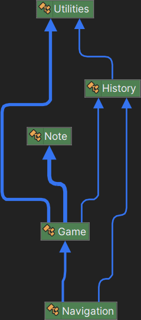

# Guitar Hero

Projekt zaliczeniowy na przedmiot *Wstęp do programowania obiektowego* na [Akademii Górnośląskiej](https://www.gwsh.pl)
w Katowicach.

## Uruchomienie

Projekt wymaga środowiska [.NET](https://dotnet.microsoft.com/download/dotnet) w wersji **7.0** lub nowszej.

Po sklonowaniu repozytorium należy wykonać polecenie `dotnet run` w katalogu projektu.

## Zasady gry

Do gry wykorzystywane są trzy klawisze: **A**,**S** oraz **D**.

Na planszy znajdują się trzy kolumny podpisane tymi
klawiszami. Gdy w którejś z nich, bezpośrednio nad klawiszem, znajdzie się znak **X**, należy nacisnąć przypisany do
niej klawisz. Czas na reakcję wynosi domyślnie sekundę i zmniejsza się wraz z upływem czasu gry. Za każdą poprawną
reakcję gracz otrzymuje punkt, a pomyłka lub brak reakcji skutkuje zakończeniem gry.

## Struktura projektu

Projekt wykorzystuje dwa wątki: główny oraz wątek dodatkowy `keyPressThread`, odpowiadający za obsługę wejścia z
klawiatury i adekwatne reagowanie na nie. Synchronizacja dostępu do zasobów współdzielonych jest zrealizowana za pomocą
blokady.

Historia wyników jest zapisywana w automatycznie tworzonym pliku `AppData/Roaming/GuitarHero/History.txt` w katalogu
domowym użytkownika.

### Podział klas

- `Navigation` - zarządzanie nawigacją aplikacji
- `Game` - zarządzanie logiką gry
- `Note` - reprezentacja pojedynczej nuty na planszy
- `History` - zarządzanie historią wyników
- `Utilites` - metody pomocnicze

### Diagram

## Potencjalny rozwój

- Wybór poziomu trudności
- Zaimplementowanie globalnej historii wyników
- System żyć gracza (np. 3 pomyłki = koniec gry)
- Efekty dźwiękowe

## Autor

- [Jakub Bukała](https://github.com/Jaku-BB)